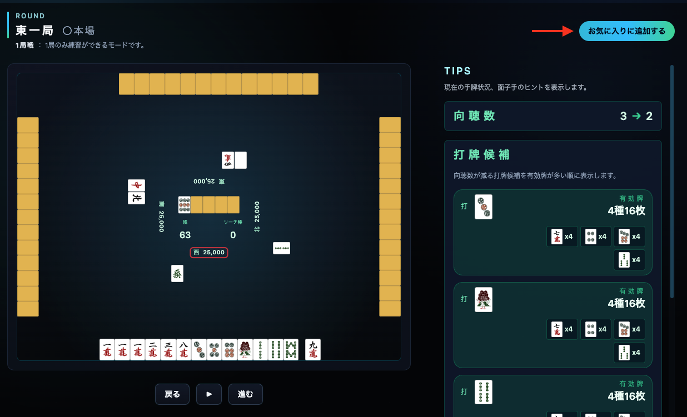

# Tenpai Speeder

Tenpai Speederは、聴牌に近づくための切り方を視覚的に学べる麻雀トレーニングサービスです。AI対局で実戦感覚を保ちつつ、有効牌や向聴数を確認しながらプレイできます。

## 使い方

1. 遊びたいゲームモードを選択します。


2. ゲームが開始されますので、打牌選択、ポン、チー、カンを駆使して和了を目指しましょう。


3. 特定の局面まで戻りたい場合、「戻る」ボタンを押してゲームを巻き戻しすることも可能です。


4. 戻りたい局面まで戻せたら「▶︎」ボタンを押してゲームを再開しましょう。


5. SNSログインの場合、お気に入りに追加することができます。気になった対局があれば、お気に入りに追加しましょう。




## セットアップ

以下のコマンドを実行します。

```zsh
git clone https://github.com/Ryooo-k/tenpai-speeder.git
cd tenpai-speeder
```

torch-rb を使うため、LibTorch を vendor/libtorch に事前に入れてから bundle を行う必要があります。
（Dockerfile と同じ 2.8.0 CPU 版）

https://github.com/ankane/torch.rb

Mac arm64の場合は以下を使用します。

```zsh
export TORCH_HOME="vendor/libtorch"
export LIBTORCH_VERSION=2.8.0
export LIBTORCH_VARIANT=cpu

curl -L "https://download.pytorch.org/libtorch/${LIBTORCH_VARIANT}/libtorch-shared-with-deps-${LIBTORCH_VERSION}%2B${LIBTORCH_VARIANT}.zip" -o /tmp/libtorch.zip
mkdir -p "$TORCH_HOME"
unzip -q /tmp/libtorch.zip -d "$TORCH_HOME"/..

bundle config build.torch-rb --with-torch-dir=$TORCH_HOME
```

Linux x86-64 の場合は、CUDA バージョンに合ったビルドを使用してください。
その他のプラットフォームの場合は、LibTorch をソースからビルドしてください。

https://pytorch.org/get-started/locally/

libtorch の準備が完了次第、セットアップを行います。

```zsh
bin/setup
```

## 開発サーバーの起動

以下のコマンドを実行してサーバーを起動し、ブラウザで http://localhost:3000 にアクセスします。

```zsh
bin/dev
```

## Lint

以下のコマンドを実行してください。

```zsh
bundle exec erb_lint --lint-all

npx eslint .

bundle exec rubocop
```

## テスト

以下のコマンドを実行してください。

```zsh
rails test:all
```

## 技術スタック
- バックエンド: Ruby 3.4.4 / Rails 8.0.2 / SQLite
- フロントエンド: Hotwire (Turbo / Stimulus), Tailwind CSS (tailwindcss-rails)
- 認証・機能: OmniAuth (Google) + セッションログイン
- テスト: Minitest
- コード品質: RuboCop, ERB Lint, ESLint + Prettier
- CI/CD: GitHub Actions
